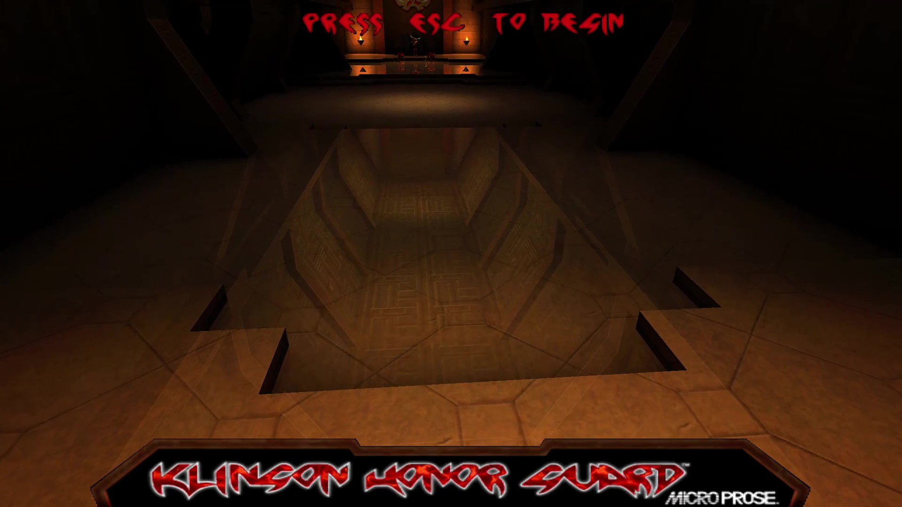

# Klingon Honor Guard — Android

A native Android port of *Star Trek: Klingon Honor Guard* (1998), the **Unreal Engine 1**
first-person shooter. It boots to the menu and plays through real missions on-device, with a
from-scratch Vulkan renderer, on-device FMV cutscenes, and full gamepad support.

The engine base is [fgsfdsfgs/UE1](https://github.com/fgsfdsfgs/UE1) (a UE1 v200 source port)
on the [Andiweli/Unreal-Android](https://github.com/fgsfdsfgs/UE1) Android bring-up, surgically
adapted to be binary-compatible with KHG's **build-219** fork of the engine. The renderer is a
new Vulkan render device written against the build-219 `URenderDevice` interface, informed by the
UT99 Vulkan driver.

No game data is included. You need your own retail copy of *Klingon Honor Guard* (original
CD + patches, or an existing PC install) and you supply its data files yourself.

## Features

- **Vulkan renderer** — a from-scratch `VulkanDrv` render device draws the 3D BSP world with
  baked lightmaps, Gouraud-shaded characters/meshes, translucency, and the 2D HUD/menu at ~60 fps.
  This is the only renderer; there is no OpenGL ES path.
- **On-device FMV** — the intro movie, the MicroProse splash, mission briefings, and the
  decorated Klingon comm-frame cutscenes all decode and play through a bundled LGPL FFmpeg build.
- **Save / load** — saving and loading game state works through the engine's hub/save system.
- **Touch screen controls and external gamepad support** — a console-FPS-style gamepad layout with ini-tunable stick sensitivity and a low-latency right-stick look filter.
- **Handheld-friendly UI** — semi scalable 2D fonts and HUD for small high-DPI screens.
- **In-app data import** — if no game data is found at launch, the app lets you pick your retail
  `Unreal` data folder or a ZIP of it with the system file picker and copies it into place. No
  storage permission is required.

## Screenshot



## Requirements

- Android 6.0+ (API 23) on an **armeabi-v7a** (32-bit ARM) device with Vulkan support. The
  current build targets 32-bit ARM only; the arm64 variant is not enabled.
- A retail copy of *Star Trek: Klingon Honor Guard*. You need its `System`, `Maps`, `Textures`,
  `Sounds`, and `Music` directories, plus the `.avi` movie files from `System/`.
- **A gamepad.** On-screen touch controls are not implemented yet, so a physical controller is
  currently required for gameplay (touch is used only to skip cutscenes).

### 1. Get the APK

Download the latest signed `app-release.apk` from the
[**Releases**](https://github.com/imjustadudegamer/Klingon-Honor-GUARD-Android/releases) page,
or build it yourself (see [Build](#build)).

### 2. Install it

Copy the APK to your device and open it to install. You may need to enable *Install unknown
apps* for your file manager or browser in Android settings the first time. Or, over USB with
developer mode on:

```sh
adb install app-release.apk
```

### 3. Connect a gamepad

A physical controller is **required** — there are no on-screen touch controls yet. Pair a
Bluetooth/USB gamepad before launching.

### 4. Provide your game data (first launch)

The app ships no game assets. On first launch, if no data is found, it asks for your retail
*Klingon Honor Guard* data. Two ways:

- **In-app import (easiest):** the launcher offers a **folder picker** and a **ZIP picker**.
  Point it at your retail `Unreal` data folder (or a ZIP of it) and it copies the files into
  place and starts the game. No storage permission is required. Next launches go straight in.
- **Manual (adb):** copy the data under `/sdcard/Unreal`, preserving the original layout —
  `/sdcard/Unreal/System`, `/Maps`, `/Textures`, `/Sounds`, `/Music`, with the `.avi` movies in
  `System/`. Saves are written to `/sdcard/Unreal/Save`.

Exact `adb push` commands for manual staging are in **[docs/BUILD.md](docs/BUILD.md)**.

## Known issues

This is a work in progress and is still being play-tested. Known issues:

- **Some effects and fine FMV compositing details** are still being refined.
- **Long-session engine stability** — the original UE1 game logic has latent actor-lifecycle
  edge cases that can surface after extended combat; these are being fixed reactively.
- **Minor graphical glitches** (occasional shimmer on some distant surfaces) may appear; the
  reflective menu floor's shimmer is faithful to the original PC release, not a port bug.
- **Please report issues** so they can be tracked and fixed.

## Build

Everything needed to build is in this repository (the UE1 engine, SDL2, the renderer, audio, and
the prebuilt SPIR-V shaders). No game data is required to build — only to run.

Prerequisites: Android SDK (`android-36`), NDK `27.0.12077973`, CMake `3.22.1`, JDK 21,
Gradle 8.13. Point Gradle at your SDK with a `local.properties`:

```sh
echo "sdk.dir=/path/to/Android/sdk" > local.properties
```

Then build:

```sh
./gradlew :app:assembleDebug    # output: app/build/outputs/apk/debug/app-debug.apk
```

Prerequisite versions, SDK component install, and how to deploy/run on a device are in
**[docs/BUILD.md](docs/BUILD.md)**.

## License & credits

This is an **unofficial, non-commercial fan project**, not affiliated with or endorsed by Epic
Games, MicroProse, Microsoft, or any rights holder. It includes **no game assets** — you supply
your own retail copy.

- **Unreal Engine** © Epic Games. The engine baseline derives from publicly available UE1 v200
  source with proprietary assets removed.
- **Star Trek: Klingon Honor Guard** © MicroProse / Microsoft and the respective rights holders.
- **FFmpeg** is used for movie decoding under the **LGPL-2.1** (LGPL build, dynamically linked;
  built without `--enable-gpl` / `--enable-nonfree`). Source: <https://ffmpeg.org>.
- Built on **[fgsfdsfgs/UE1](https://github.com/fgsfdsfgs/UE1)** and
  **Andiweli/Unreal-Android**; uses **SDL2**, **OpenAL Soft**, and **libxmp**. The Vulkan
  renderer architecture is informed by the UT99 Vulkan render device.

Full attribution is in **[CREDITS.md](CREDITS.md)**; the full third-party license notices are in
**[THIRDPARTY.md](THIRDPARTY.md)**.

## Documentation

- **[docs/BUILD.md](docs/BUILD.md)** — prerequisites, building, deploying, running.
- **[docs/ARCHITECTURE.md](docs/ARCHITECTURE.md)** — engine base, source layout, port modifications.
- **[docs/RENDERER.md](docs/RENDERER.md)** — the Vulkan render device.
- **[docs/FMV.md](docs/FMV.md)** — the cutscene / FMV system.
- **[docs/CONTROLS.md](docs/CONTROLS.md)** — controller configuration reference.
</content>
</invoke>
